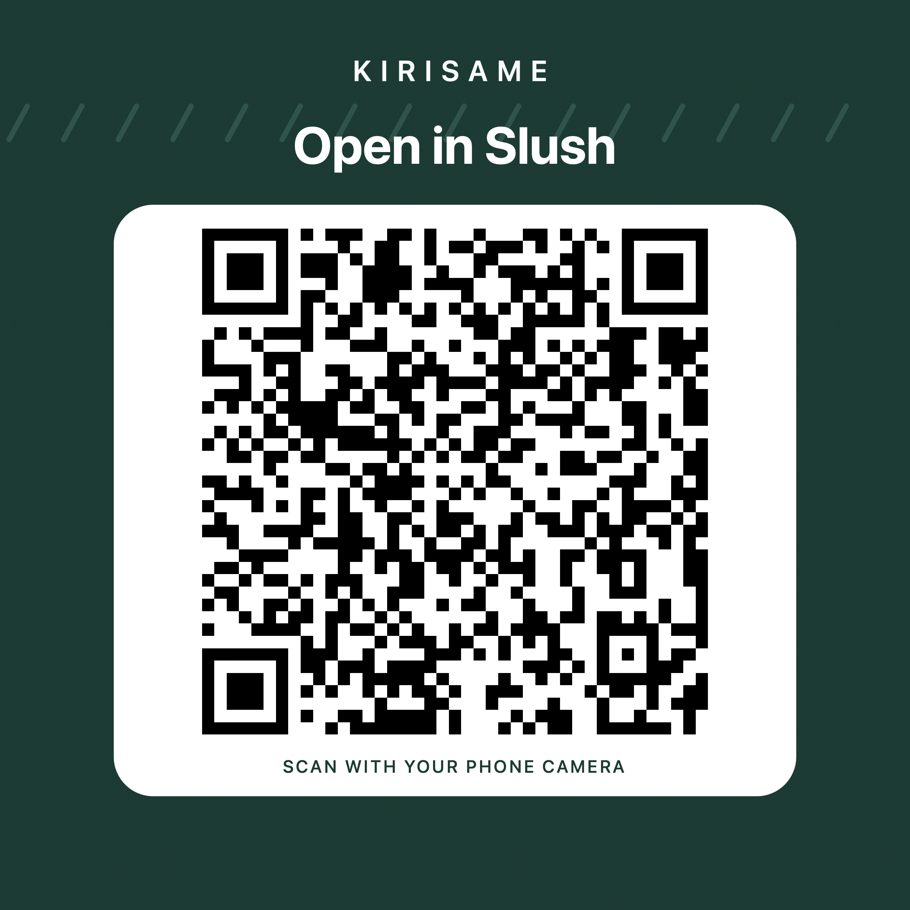

# Kirisame

Umbrella-sharing protocol on Sui, implemented in [kirisame::umbrella](move/kirisame/sources/kirisame.move).

<!-- deployment:start -->
Current deployment (testnet): [View contract on Sui Explorer](https://suiscan.xyz/testnet/object/0x874d02605f90523d5de696a10073ed785d50bddb78c9e2dad06b8f9200fd9763).
<!-- deployment:end -->

ROBOTS DONT EDIT THIS 

## Sources of truth

- [Constitution](docs/constitution.md): final authority for responsibilities, incentives and governing decisions.
- [Current contract](move/kirisame/sources/kirisame.move): implemented behavior.
- [Contract flows](docs/project-flows.md): lifecycle diagrams.

## How To Demo

Requirements: You will need to have Slush installed on your phone with camera and location permission enabled

Set Slush to use Testnet in advance settings

Scan this code to get started or navigate to https://kirisame-dapp.onrender.com

Click the Connect Slush Wallet button. If you want to use Admin or Station functions, you'll need an account with authorization. 

Station private key: suiprivkey1qqcklr0c0lhycgyp3s5s7yppshfuhlqluf6cx5hqx4xw6yrszaw4zr9hstz
Admin private key: suiprivkey1qr7gm50q2ja7ajxv50qqur6dxm8g67ny9vv668mtg32ssypfk2uj2zq2yn7

As a non privileged user, the only functions available to you are in the User tab. You can scan an umbrella or supply a new one. You can find umbrellas to scan in the umbrella list in the Admin tab. 

After you supply a new umbrella, it won't be available for purchase until you dock it. This is a station function, so you'll need to use the station account to dock the umbrella (that's because the station itself is the one that reads the returned QR code, not the user)

Admins can create, transfer and remove stations. Total removal of a station requires all docked umbrellas to be checked out or retired. 