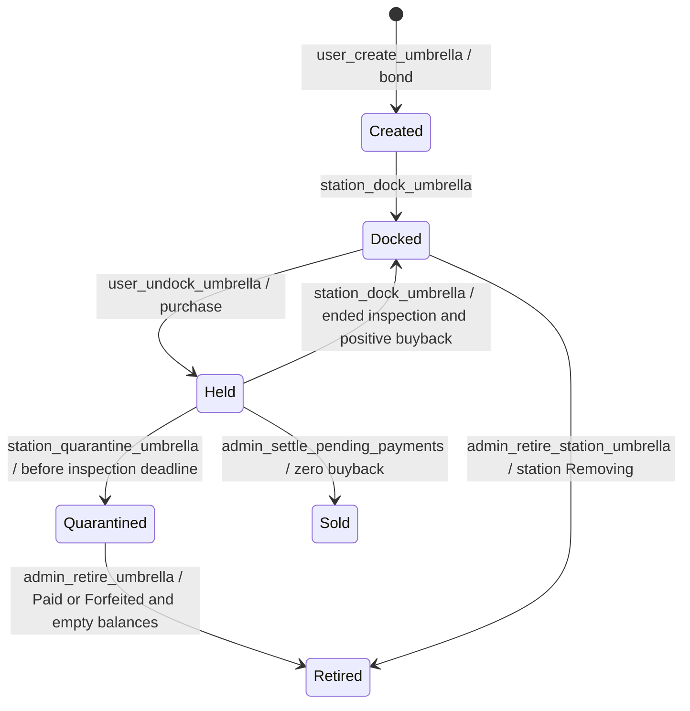
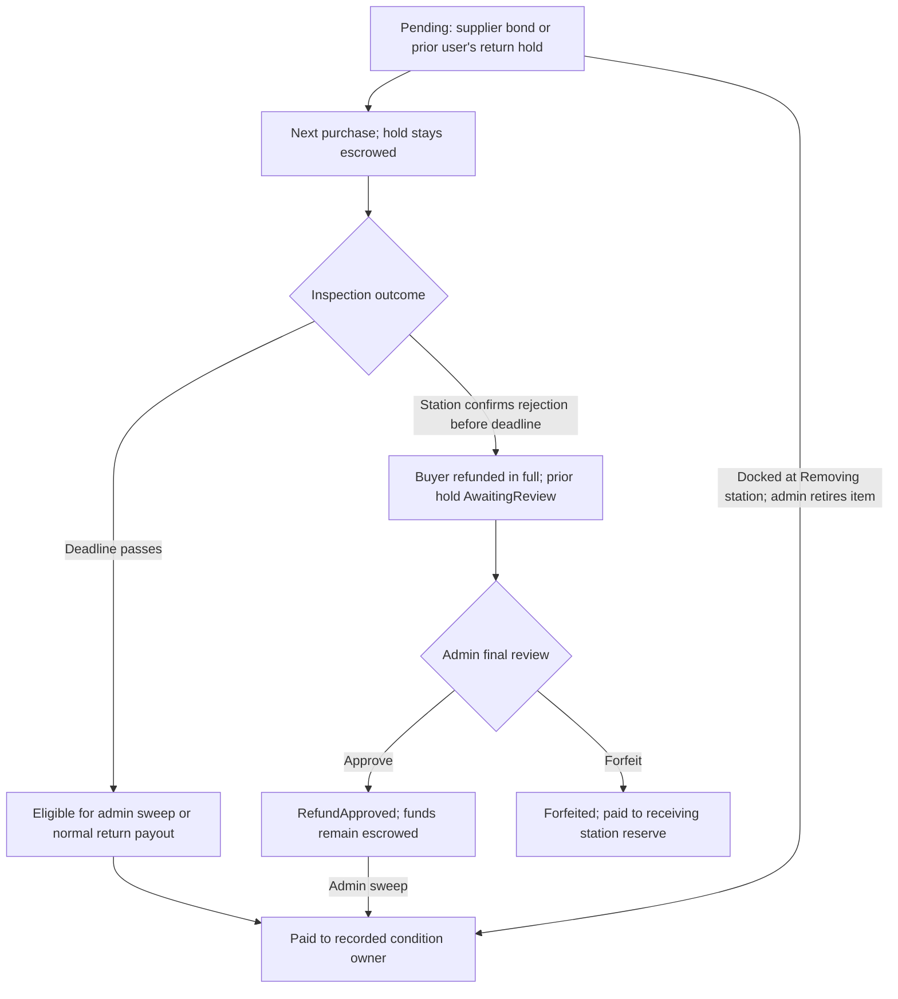
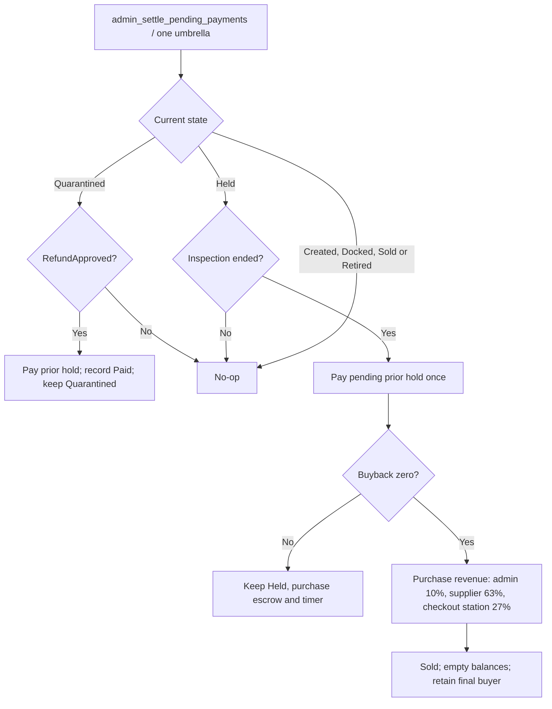
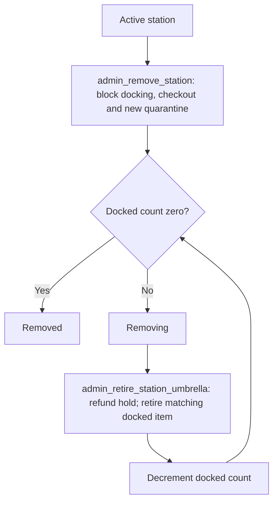

# Kirisame contract flows

These diagrams reflect the [current contract](../move/kirisame/sources/kirisame.move). Design authority remains the [constitution](../../sui-stack-hello-world/docs/actor-responsibilities.md).

## Umbrella custody

Docking, checkout and quarantine require an Active station. Station attestations require its StationCap; admin actions require AdminCap. Inspection starts at checkout inside Held. Time passing never changes stored state. Sold retains the final buyer; Retired clears the current station. Neither can re-enter circulation.

## Condition funds

Quarantine review can concern wear or undesirability. Rejection alone does not forfeit the hold. Approved refunds require settlement; neither review outcome reactivates the item. A normal return creates a new condition record for the returning user. There is no customer claim action or automatic timeout.

## Admin settlement

Normal returns independently split usage revenue: nominally 10% admin, 63% supplier, 13.5% checkout station and 13.5% return station. The buyer receives buyback above the new condition hold. Payouts use the contract’s integer rounding. Settlement needs an admin transaction; the contract does not run a background timer.

## Station removal

Retirement is mandatory work before completion, not an automatic loop over shared objects. Admins may process bounded batches. Held items are unaffected and may return to another Active station; existing quarantine reviews and payments remain possible. The retained station capability cannot bypass status checks. Physical collection is an operator/admin responsibility.
