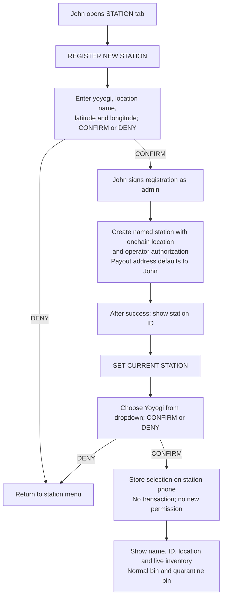
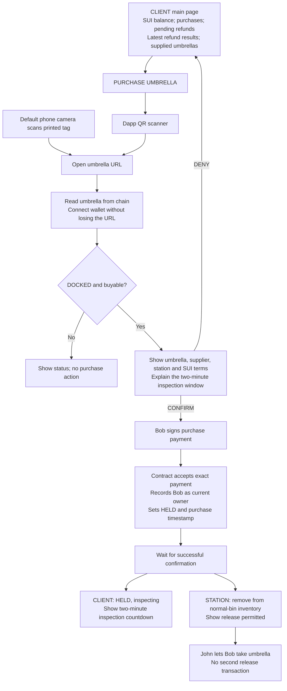
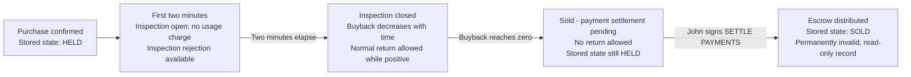
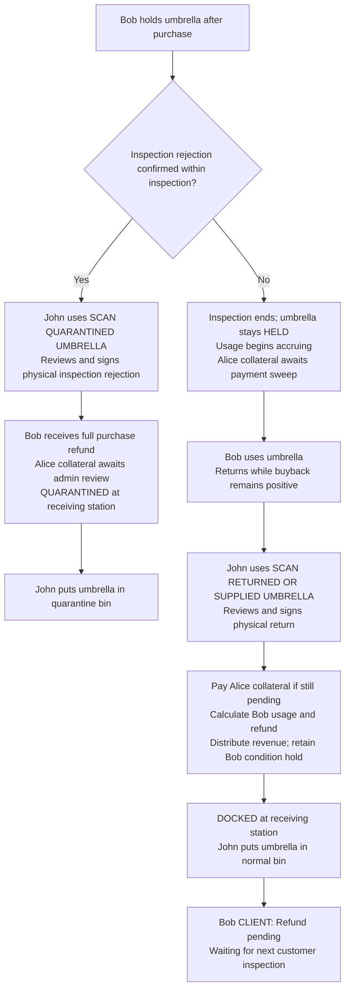
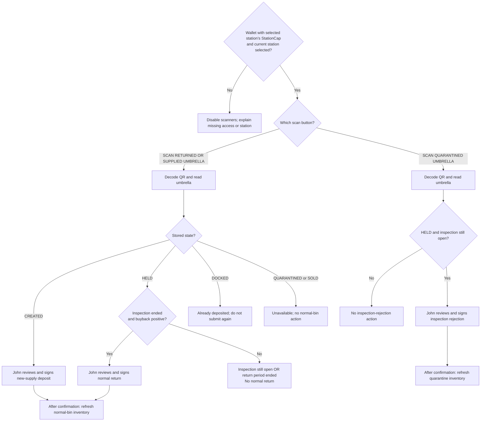
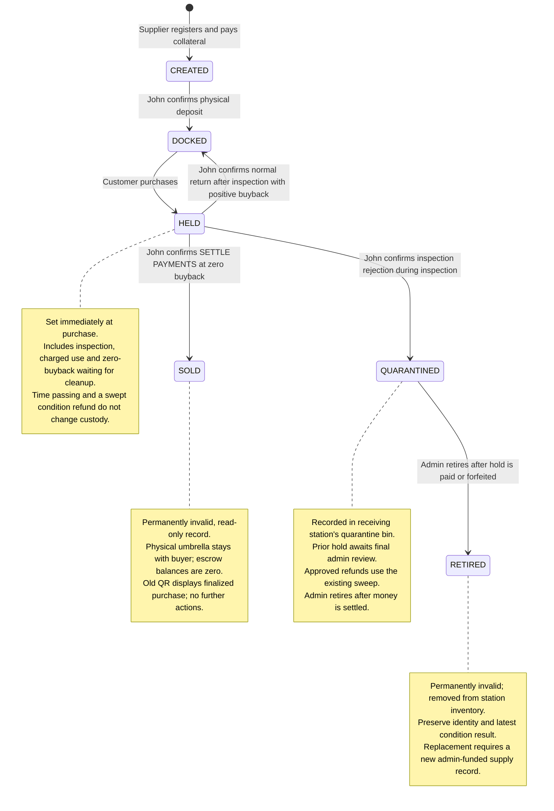
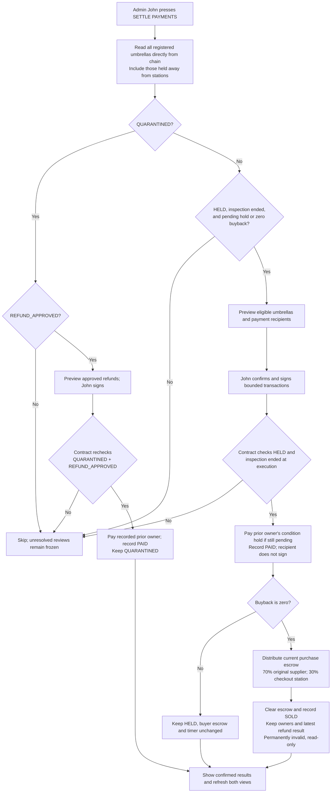
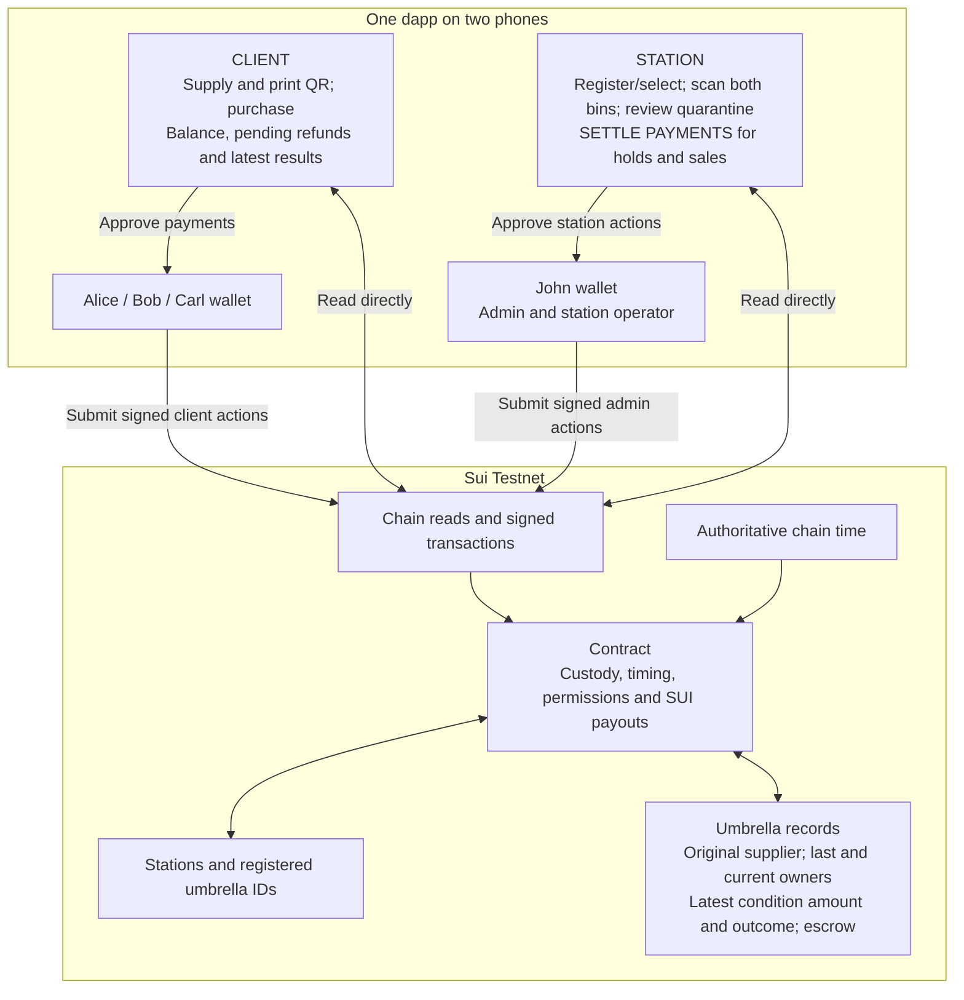

# Umbrella sharing — project flows

This document shows user actions, custody states and money movement for the [main MVP plan](mvp-plan.md). Contract function names and field definitions belong in that plan.

**One dapp, two phones.** Alice, Bob and Carl use CLIENT. John uses STATION and is both admin and station operator for the demo. Station registration and sweeps require AdminCap; physical deposits and returns require the receiving station’s StationCap. All money and gas use native SUI. Both phones read the chain directly; there is no application server or background worker.

**Purchase sets HELD immediately.** Inspection is the first two minutes of that purchase, not a separate stored state. Time passing never needs a timer-start transaction. **One SETTLE PAYMENTS sweep handles both payouts:** it releases eligible condition holds after inspection and, at zero buyback, distributes purchase escrow and records SOLD. Customers never submit refund claims.

## 1. Alice supplies an umbrella

Assume John has selected a registered station; section 2 shows that setup.

```mermaid
sequenceDiagram
    actor Alice
    participant Client as CLIENT phone and Alice wallet
    participant Chain as Sui contract
    participant John as John - admin and station operator
    participant Station as STATION phone and John wallet

    Alice->>Client: SUPPLY UMBRELLA
    Client-->>Alice: Review collateral; CONFIRM or DENY
    Alice->>Client: CONFIRM and sign 0.03 SUI collateral payment
    Client->>Chain: Register new umbrella and escrow supplier collateral
    Chain-->>Client: Umbrella ID; CREATED; supplier Alice
    Client-->>Alice: Printable QR, URL and object ID
    Alice->>Alice: PRINT QR and attach tag
    Alice->>John: Hand over tagged umbrella
    John->>Station: SCAN RETURNED OR SUPPLIED UMBRELLA
    Station->>Chain: Read umbrella and station
    Chain-->>Station: New supply awaiting physical deposit
    John->>Station: Review and sign deposit
    Station->>Chain: Attest arrival at selected station
    Chain-->>Station: DOCKED; available to purchase
    John->>John: Put umbrella into normal bin
```

Alice can reopen and reprint the same tag without another payment. Her collateral becomes eligible for the sweep after the first customer's inspection ends without rejection. It is paid by the sweep or that customer's eligible normal return, without Alice signing another transaction. An inspection rejection freezes it for final review by the collecting admin. Alice remains the original supplier and revenue recipient across later purchases.

## 2. John registers and selects a station



Registration and sweeps require admin access. Physical deposit and return transactions require only authorization for the selected station, enforced onchain. Selecting a station does not grant that authority. Inventory data itself remains public.

## 3. Bob purchases the umbrella

The default camera and in-dapp scanner lead to the same confirmation page. Bob does not scan twice.



The client also offers **SUPPLY UMBRELLA**, which opens the flow in section 1. Purchasing escrows the full price upfront. Gas is separate from that payment.

## 4. One HELD state, three time-based phases

These are **display phases**, not additional stored custody states.



Inspection ending requires no signature, acceptance action or state transition. The dapp estimates buyback from the purchase timestamp; transactions use chain time for the authoritative result. Charges apply only to elapsed time **after purchase time plus 120 seconds**.

At the current demo rate, buyback reaches zero 7 minutes 3.031 seconds after purchase. At that exact cutoff returns are prohibited, even if settlement has not run. A scan or signature before the cutoff does not reserve return eligibility.

## 5. Bob rejects or returns



The inspection-rejection transaction must execute before the inspection deadline. The normal-return transaction may execute at or after the inspection deadline and strictly before buyback reaches zero. After inspection, the holder accepts responsibility for continued acceptability; there is no late full-refund rejection.

If Bob's return executes exactly five minutes after purchase, three minutes are charged: **0.0594 SUI usage, 0.0106 SUI immediate refund, and 0.03 SUI pending**. For shorter use, buyback above the 0.03 SUI condition hold is paid immediately. No earlier sweep is required for a normal return.

## 6. Carl's inspection determines Bob's pending refund

```mermaid
sequenceDiagram
    actor Carl
    participant Client as CLIENT phone and Carl wallet
    participant John as John - admin and station operator
    participant Chain as Sui contract
    participant Bob as Bob wallet and CLIENT view

    Carl->>Client: Scan Bob's returned umbrella; open purchase page
    Carl->>Client: CONFIRM and sign 0.10 SUI purchase
    Client->>Chain: Submit purchase
    Chain->>Chain: Set HELD with Carl as current owner; retain Bob's pending hold
    Note over Chain,Bob: Carl's first two minutes are inspection

    alt Carl rejects before inspection ends
        Carl->>John: Physically surrender umbrella
        John->>Chain: Scan quarantine tag and sign inspection rejection
        Chain-->>Carl: Refund full 0.10 SUI purchase
        Chain->>Chain: Freeze Bob hold as AWAITING_REVIEW
        Chain-->>John: QUARANTINED; place in quarantine bin
        Bob->>Chain: Refresh latest refund results
        Chain-->>Bob: Awaiting admin review; hold remains escrowed
        John->>John: Inspect quarantined umbrella during collection
        John->>Chain: Submit final review using AdminCap
        alt Refund approved
            Chain->>Chain: Record REFUND_APPROVED; retain hold
            John->>Chain: Run existing SETTLE PAYMENTS sweep
            Chain-->>Bob: Pay hold and record PAID
        else Unsuitable for circulation
            Chain->>Chain: Send hold to fixed reserve; record FORFEITED
        end
    else Carl does not reject
        Note over Chain,Bob: Deadline passes; state remains HELD; no automatic payment
        Bob->>Chain: Read pending refund status
        Chain-->>Bob: Awaiting payment sweep; no action needed
        John->>Chain: SETTLE PAYMENTS; sign as admin
        Chain-->>Bob: Pay 0.03 SUI; retain paid result
        Note over Client,Chain: Carl remains HELD; ownership and timer unchanged
    end
```

Bob keeps the 0.0106 SUI already paid on his return even if Carl rejects; only the pending 0.03 SUI is subject to the admin’s final review. Wear, appearance and other undesirability can justify quarantine; the review does not assign blame for damage.

If Carl returns before the sweep, his eligible normal return pays Bob's pending hold. Alice's initial collateral uses the same sweep rules. Each hold is paid once; neither recipient signs a refund transaction.

At zero buyback, the same sweep also finalizes Carl's purchase. The demo requires John to submit sweeps; an unattended service would need a funded transaction runner. No next purchase means Bob's hold stays pending while the umbrella is DOCKED.

The latest result survives refresh while Bob remains the last owner. Carl's next normal return replaces that record with Carl's new condition hold; the MVP does not keep a complete historical ledger.

## 7. Station scanners



Pause scanning after one decoded tag and prevent repeated prompts. The chain rechecks state, time, authorization and purchase cycle at execution. On a failed or denied transaction, do not show a completed deposit or refund. Refresh uncertain transaction results before retrying.

## 8. Custody state machine



These six states are the entire stored custody model. HELD does not imply that a prior owner's condition hold has already been paid. At zero buyback the item is effectively sold; the final transaction pays remaining funds and records that outcome as SOLD.

## 9. SETTLE PAYMENTS — one sweep for holds and sales



All payout paths use the same `admin_settle_pending_payments` function. Checks and payouts for each umbrella execute atomically. If a batch fails, its operations roll back; refetch and retry only eligible items. Repeated submissions cannot pay twice. The selected station does not affect eligibility or recipients.

The buyer pays nothing more. For a finalized 0.10 SUI purchase, the supplier receives 0.07 SUI and the checkout station receives 0.03 SUI. An unpaid prior owner's condition hold is a **separate balance** and is also released. It does not reduce those 0.10 SUI proceeds.

The sweep never starts usage, changes a purchase into HELD, processes physical returns, or releases holds on umbrellas waiting DOCKED for another customer. Time alone does not submit transactions; the demo admin runs the sweep.

## 10. Refund and revenue accounting

Normal return requires positive buyback and uses **70% supplier / 15% checkout station / 15% return station** for usage revenue. Zero-buyback cleanup uses **70% supplier / 30% checkout station** for the full purchase escrow. All amounts exclude gas.

| Bob returns exactly five minutes after purchase | SUI |
| --- | ---: |
| Purchase payment | 0.1000 |
| Usage fee: three charged minutes | 0.0594 |
| Supplier portion of fee | 0.04158 |
| Checkout station portion of fee | 0.00891 |
| Return station portion of fee | 0.00891 |
| Immediate refund | 0.0106 |
| Bob's new pending condition hold | 0.0300 |

The first two minutes are free inspection. Afterward, the demo rate is 0.0198 SUI per minute. The calculation is based on elapsed time; no process runs a timer onchain. The contract uses exact integer amounts, so a displayed value rounded to zero must not decide return eligibility.

An inspection rejection refunds the current customer’s purchase payment and freezes the prior hold. The admin’s final review either approves that hold for the sweep or forfeits it to the fixed maintenance reserve. While buyback is positive, the sweep pays only the pending condition hold; it never refunds the current buyer's active purchase.

## 11. System responsibilities



Station registration, final quarantine reviews and sweeps require AdminCap; physical deposits and quarantine intake require the receiving station’s StationCap. Customers supply and purchase; eligible refunds arrive through the sweep or a normal return without customer action. Static dapp hosting and chain access are sufficient; no server, timer worker or internal-function controls are part of these flows.

Unreviewed holds have no timeout in this version. Normal-bin holds still wait for a successor inspection. Maximum waiting periods and review-timeout refunds require a separate policy decision.

## 12. Retire and replace

During collection, John acts as admin: finalize review, run the existing sweep for
an approved refund, then retire the settled quarantine record. These calls can be
batched into one transaction. Retirement moves no funds; it removes the item from
inventory and leaves the old QR displaying RETIRED with the latest condition result.

For reuse or replacement, John supplies a new umbrella through the existing client
flow and pays a fresh bond. The admin is the new supplier; the new object gets a
new QR and requires normal station activation. No reactivation path is added.
