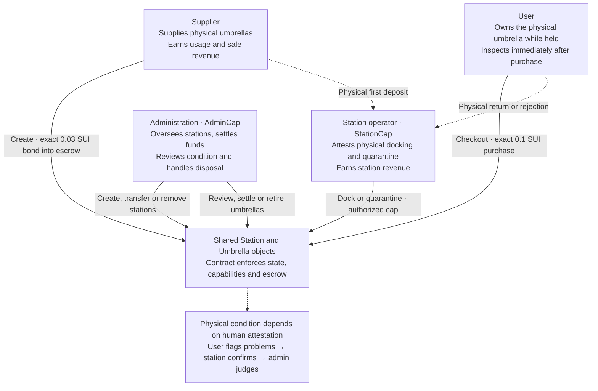
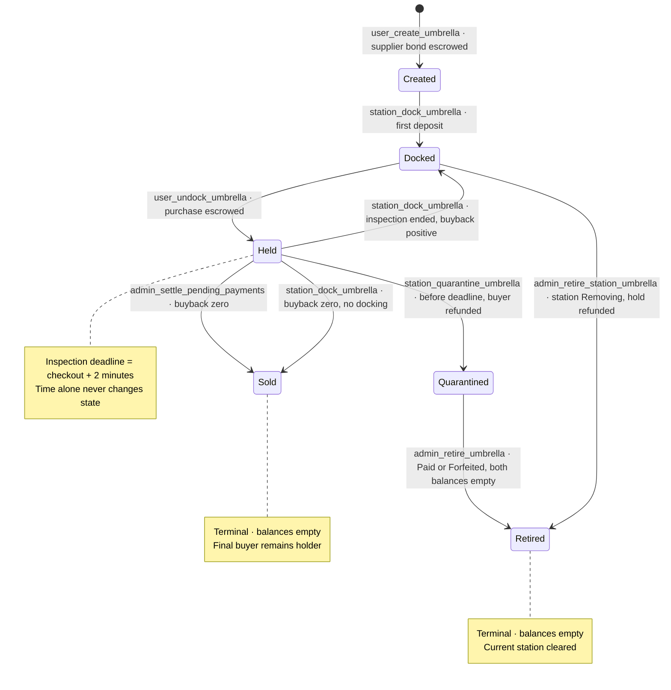
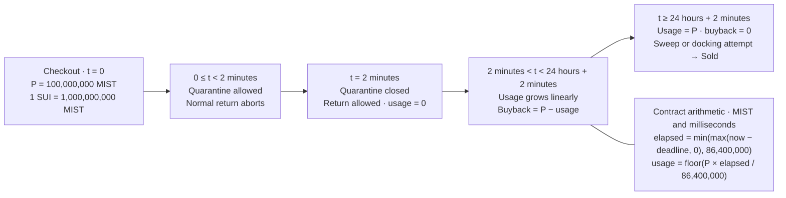
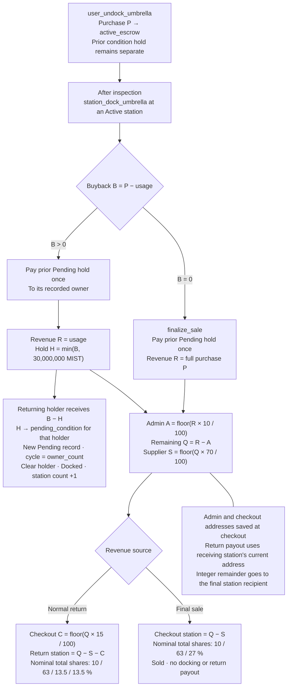
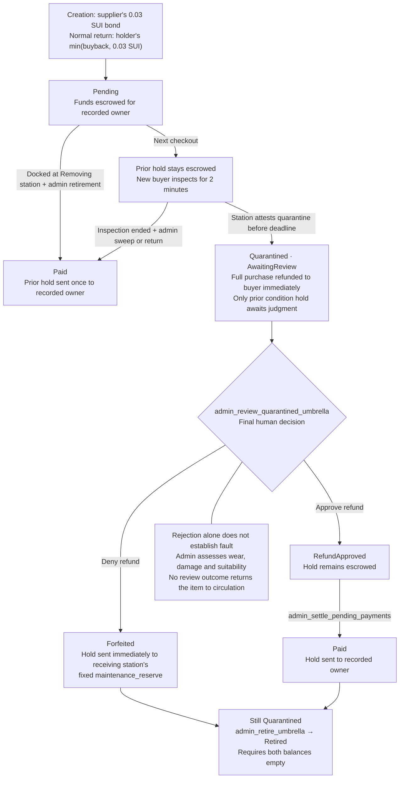
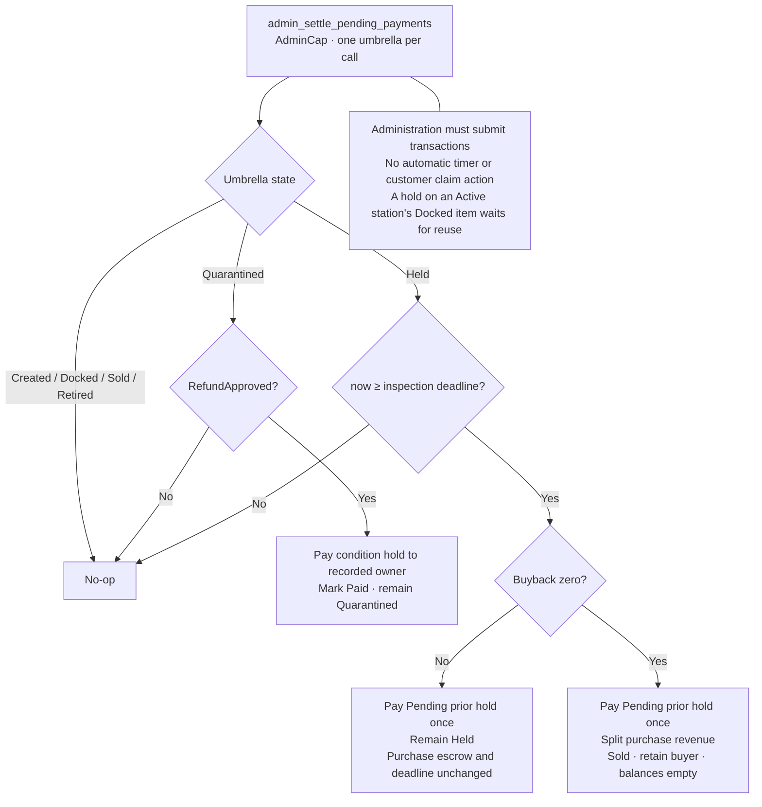
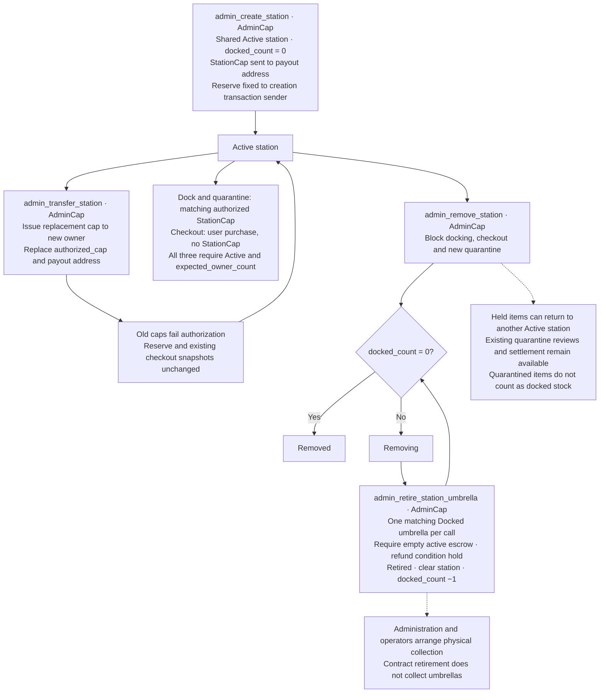

# Kirisame diagrams

Behavior: [contract](../move/kirisame/sources/kirisame.move). Rationale: [constitution](constitution.md). Where they differ, these diagrams follow the contract.

## Actors and trust

## Umbrella lifecycle

## Inspection and price

## Purchase, return and revenue

## Condition hold and quarantine review

## Admin settlement

## Station authority and removal

